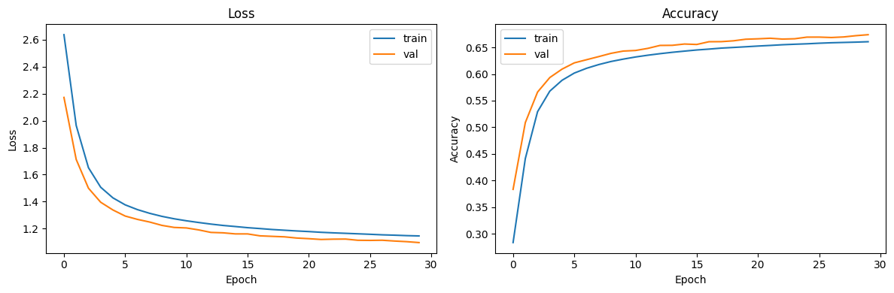

# Character-Based Language Model

A character-level text generation model built with TensorFlow and a GRU-based recurrent neural network. Trained on ~2,700 business news articles to generate text one character at a time.

## Model Architecture

| Layer | Details | Parameters |
|-------|---------|-----------|
| Embedding | 106 characters -> 128d vectors | 13,568 |
| Dropout | rate=0.2 | 0 |
| GRU | 512 units, input dropout=0.2 | 986,112 |
| Dense | 512 -> 106 (logits) | 54,378 |
| **Total** | **4.02 MB** | **1,054,058** |

**How it works**: The model reads a sequence of characters, encodes each one into a 128-dimensional vector, processes the sequence through a GRU that builds up context over time, and outputs a probability distribution over the next character. During generation, we sample from this distribution and feed the result back as input, producing text one character at a time.

## Dataset

| Detail | Value |
|--------|-------|
| Source | 2,692 business news articles |
| Total characters (after cleaning) | ~4.5M |
| Vocabulary size | 106 unique characters |
| Sequence length | 100 characters |
| Train/Val split | 90% / 10% |

**Preprocessing**: HTML tag removal, unicode normalization (smart quotes, em dashes -> ASCII), URL removal, whitespace collapsing. Digits, punctuation, and casing are preserved since the model needs to learn those patterns.

## Training

| Hyperparameter | Value |
|---------------|-------|
| Optimizer | Adam (default lr=0.001) |
| Loss function | Sparse Categorical Crossentropy |
| Batch size | 128 |
| Epochs | 30 (with early stopping, patience=5) |
| Dropout | 0.2 (embedding + GRU input) |
| Recurrent dropout | 0.0 (for CuDNN compatibility) |

### Results

| Metric | Train | Validation |
|--------|-------|------------|
| Loss | 1.145 | 1.096 |
| Accuracy | 66.1% | 67.4% |

The small gap between train and val metrics shows the model is generalizing well, not overfitting. Dropout and the relatively large dataset (4.5M chars vs 1M params) both contribute to this.



### Sample Output (temperature=0.8)

```
Seed: "KARACHI:"
Output: "KARACHI: Pakistan find by a director of Asian trade on Wednesday
slows. The first ball will gave the Federal Reserve prized by her format,
and the first target of 121 months come out of the day."
```

## Setup

```bash
conda create -n char-based-llm python=3.10 -y
conda activate char-based-llm
pip install -r requirements.txt
```

## Usage

Open `char_based_lm.ipynb` in Jupyter or VS Code and run all cells. The notebook will:

1. Load and preprocess the article data
2. Build a character-level vocabulary
3. Train the GRU model with early stopping and validation monitoring
4. Generate text from seed strings with configurable temperature
5. Save the model in Keras format for Hugging Face upload

## Project Structure

```
char-based-language-model/
├── char_based_lm.ipynb    # Training and generation notebook
├── requirements.txt       # Python dependencies
├── .gitignore
├── README.md
├── data/
│   └── Articles.csv       # Training dataset
└── saved_model/           # Generated after training (gitignored)
    ├── model.keras
    ├── vocab.json
    └── config.json
```